# KBD-IR Service Specification

## Overview
- 音楽ゲーム大会を管理・採点するWebサービス。既存のlab_attendanceスタック（FastAPI + Next.js）を流用する。
- 対象サークル: `kbm`, `bbd`。専用大会に加えて合同大会、運営テスト大会をサポートする。
- ユーザーは必ず1サークルに所属（`superadmin`のみ両サークル横断）。ログインはパスワード認証。
- 目的: 大会作成管理、機種・曲の設定、ユーザーのスコア提出と写真による検証を一元化。

## Tournament Taxonomy
- **KBM大会**: kbm所属ユーザーが閲覧・参加。
- **BBD大会**: bbd所属ユーザーが閲覧・参加。
- **合同大会**: 両サークルユーザーが閲覧・参加。両サークルのadminが編集可。
- **運営テスト大会**: visibility=`ops_test`。admin以上のみ閲覧・編集。KBM/BBD/合同それぞれにテスト用大会を作成可能。
- 大会ごとに複数機種を保持し、機種ごとに曲を自由登録可能。

## Roles & Permissions
- `superadmin`: 全サークルの大会・ユーザー・設定を管理。全データ参照可。任意ユーザーのロール変更が可能。
- `kbm-admin` / `bbd-admin`: 自サークル + 合同/対応運営テスト大会を管理。大会作成・編集、機種/曲管理、スコア承認、ユーザーのロール変更（自身と同格まで昇格）を実施可能。
- `kbm-user` / `bbd-user`: 自サークル大会 + 合同大会での閲覧とスコア提出のみ。
- ロール変更は「上位ロール→下位ロール」方向で実施。管理者は自身と同格まで昇格可能だが、より上位にはできない。
- ログイン必須。URL直打ちはログイン画面へリダイレクト。

## User Lifecycle
- **登録**: ユーザーが自らサインアップし、所属サークルを選択。初期ロールは `*-user`。
- **ロール管理**: 上位者が管理UIから対象ユーザーのロールを引き上げ/下げ。
- **パスワードリセット**: Amazon SES（`kbdir@maru65536.com` など）でリセットメール送信を実装。SES検証済みドメインとして `maru65536.com` を利用。

### Password Reset Email Template (Draft)
```
Subject: 【KBD-IR】パスワードリセットのご案内

{user_name} 様

KBD-IR にてパスワード再設定のリクエストを受け付けました。
下記のリンクをクリックし、パスワードの再設定を完了してください。

リセットリンク: {reset_link}
有効期限: 発行から30分

※心当たりがない場合は、このメールを破棄してください。
※本メールは送信専用です。ご不明な点がありましたら、管理者までご連絡ください。

--
KBD-IR 運営
```

## Tournament Model Draft
- `id`, `name`, `slug`, `circle_scope`(`kbm`|`bbd`|`joint`), `visibility`(`public`|`ops_test`)
- 日付: `registration_opens`, `registration_closes`, `event_starts`, `event_ends`
- `status`: `draft`, `scheduled`, `open`, `closed`, `archived`（手動/自動更新）
- `score_cap_default`: 大会全体で許容するスコア上限（数値バリデーションに使用）
- `created_by_user_id`, `created_at`, `updated_at`

## Machine & Song Model Draft
- `Machine`: `id`, `tournament_id`, `name`, `game_code`, `description`
- `Song`: `id`, `machine_id`, `title`, `artist`, `difficulty`, `score_cap_override`, `optional_metadata`
- 曲は大会ごとに自由登録。同曲異難易度のサポートを前提に、曲タイトル＋難易度＋機種でユニーク制約を想定。

## Score Submission Flow
- ユーザーは大会→機種→曲を選択しスコア提出。
- 同一ユーザーが同大会・同機種・同曲に再提出する際は最新スコアのみ保持し、旧レコードは即時削除。
- 入力項目:
  - 数値スコア（整数、`score_cap_default` または曲の `score_cap_override` 以下）
  - 撮影日時: 内部的に提出時刻を取得（EXIF解析なし）。UI表示は提出日時のみ。
  - コメント（任意）
  - 証跡写真（1枚、必須）
- アップロード写真はS3 `kbdir/tournaments/<slug>/<song-id>/<submission-id>/raw.*` へ保存。DBにはキーとメタ情報を保持。

## Score Review UI
- レビューワ（admin以上）はキュー形式でスコアを確認。
- 画面表示: 写真サムネイル、入力スコア、ユーザー名、提出日時。
- 操作: `承認`, `差し戻し`（理由メモ任意入力）。ステータスは `pending` → `approved` / `rejected`。
- 差し戻し時にユーザーへ再提出案内（アプリ内通知のみ）。

## Frontend Considerations
- Next.js (TypeScript)。
- 一般ユーザー向け: ダッシュボード（自サークル/合同大会一覧、マイスコア一覧、提出フォーム）。
- 管理メニュー: 大会作成・編集、機種/曲編集、スコアレビュー、ユーザー管理。
- 日本語UI。未認証アクセスはログイン画面へリダイレクト。

## Backend Considerations
- FastAPI + SQLite（初期想定）。写真S3アップロード用にプリサインドURL発行APIを実装。
- 認証: パスワードベース（パスワードハッシュ、SES経由のリセットフロー）。
- スコア再提出: 最新レコードのみ保持。旧レコードは完全削除で履歴を残さない方針。
- S3クレデンシャル管理はバックエンドでIAMロールにより実施。プリサインドURLをクライアントへ返すのみ。

## Infrastructure Notes
- **アプリケーション**: lab_attendance同様のFastAPIバックエンド＋Next.jsフロントエンドを `apps/kbd-ir` に配置。既存uvicorn/Nginx構成へ `/kbd_ir` ルートを追加。
- **ストレージ**: AWS S3に `kbdir-prod` バケットを用意。大会スラッグ別プレフィックスで整理。ライフサイクルルールは設定せず無期限保存。
- **メール**: Amazon SES（`maru65536.com` ドメイン）を利用。TerraformでIdentity検証・IAMポリシー・送信権限を管理。
- **デプロイ**: 当面は `scripts/deploy_lab_attendance.sh` と同じ構成で `deploy_kbd_ir.sh`（仮）を用意。主な処理フローは下記を想定。
  1. 最新コードをpullし、フロントエンドをビルド（`npm install && npm run build`）。
  2. バックエンド用仮想環境を再作成し、`pip install -r requirements.txt` を実行。
  3. 静的アセット/バックエンドをサーバへ同期（rsyncやscpを想定）。
  4. サービスを再起動（systemd, pm2, docker-compose等、現行環境に合わせる）。
  5. 成功/失敗ログを標準出力へ記録。
- **IAM**: バックエンド実行環境用のIAMロールにS3アップロード/SES送信権限を付与。プリサインドURL発行用ポリシーは必要最小限に。
- **監視/ログ**: 既存スタックへ統合。SES送信失敗などはCloudWatch/SNS通知を追加検討。
- **環境**: 当面は `prod` シングル環境で運用。将来的に `dev/stg` を追加する際はS3バケットやSES IDを分離。

## Implementation Plan

### Backend
- **Framework & Structure**: FastAPI with dependency-injected services. Reuse lab_attendance project layout (`main.py`, `routers/`, `models/`, `schemas/`, `services/`). Introduce dedicated package `apps.kbd_ir.backend`.
- **Database Layer**: SQLAlchemy + Alembic (if lab_attendance already uses). Define models for `User`, `Tournament`, `Machine`, `Song`, `ScoreSubmission`, `ScoreReview`, `PasswordResetToken`. Enforce scoped unique constraints (e.g., `Song`: `(machine_id, title, difficulty)`). Migration 0001: create base tables and indexes.
- **Repositories/Services**: Abstract DB operations (e.g., `TournamentService` for creation and permission checks, `ScoreService` for submission/review). Centralize permission checks to avoid duplication.
- **Auth**: Reuse FastAPI security dependencies. Store passwords with `bcrypt`. Session management via signed cookies or JWT (align with lab_attendance). Implement password reset flow: token table with `user_id`, `token_hash`, `expires_at`, `used_at`. SES mailer utility to send template.
- **Uploads**: `UploadsService` generating S3 presigned PUT URLs using boto3 and IAM role credentials. Persist `photo_key` only after client confirms upload (either optimistic or callback).
- **Business Rules**: Score submission endpoint clears existing submission (DELETE query) before inserting new row. Score validation ensures within caps. Review endpoint updates `review_status` & optionally creates a `ScoreReview` record.
- **Background Tasks**: Use FastAPI background tasks for SES email send to avoid blocking.
- **Testing**: pytest with SQLite in-memory DB fixture. Mock S3 + SES via moto or local stubs.

### Frontend
- **Structure**: Next.js app under `apps/kbd-ir/frontend`. Use App Router if repo already on Next 13+. Shared UI components (layout, navigation) align with lab_attendance styling.
- **State Management**: React Query for API interactions (matching lab_attendance if used). Provide hooks: `useTournaments`, `useSubmitScore`, `useReviewQueue`.
- **Auth Flow**: Login page posting to `/auth/login`. Protect routes via middleware that checks session cookie. Provide password reset page to submit email and confirmation page handling token.
- **User Dashboards**: 
  - `DashboardPage`: lists available tournaments grouped by type.
  - `TournamentDetail`: shows machines/songs, allows score submission with uploads (use presigned URL flow + FormData for metadata). Validate score input client-side against caps.
- **Admin Tools**:
  - `TournamentEditor` with forms for schedule, caps, visibility.
  - `MachineSongManager` table with inline add/edit modals.
  - `ReviewQueue`: card UI showing photo preview + quick approve/reject buttons, keyboard shortcuts.
  - `UserManagement`: list, filter by role, promote/demote actions.
- **Styling**: Tailwind CSS if existing; otherwise CSS modules. Ensure image viewer supports zoom for audit.

### Storage & Infrastructure
- Configure Terraform module for `kbdir-prod` bucket and SES domain identity (DKIM, SPF records for `maru65536.com`). Add IAM policy granting backend role `s3:PutObject`, `s3:GetObject`, `ses:SendEmail` on relevant resources.
- Parameterize bucket name and SES sender in environment variables (e.g., `.env.prod`). Use AWS Parameter Store or Secrets Manager if available.
- Deployment script `scripts/deploy_kbd_ir.sh`: orchestrate backend venv setup, Alembic migration, frontend build, asset upload/sync, service restart. Document prerequisites (SSH, environment variables).

### Review Workflow
- Maintain `review_status` on `ScoreSubmission`. Allowed statuses: `pending`, `approved`, `rejected`.
- `ScoreReview` table logs actions for audit. On approve/reject, update submission row and insert review record. Consider optimistic locking (updated_at check) to avoid double-processing.
- Provide API to fetch next pending submission (ordered by `submitted_at`).

### Notifications
- Initially none beyond UI state changes. Optionally log notable events (score submitted, review decision) via existing logging infrastructure.

### Security & Permissions
- Guard endpoints with dependency checking role/circle scope. Ensure joint tournaments accessible to both circles. Ops test tournaments hidden by default unless role >= admin.
- Validate S3 keys so users cannot overwrite others' uploads (namespaced path enforcement).
- Rate-limit signup and password reset requests (FastAPI limiter or middleware).

### Testing & QA
- Unit tests: services and permission logic.
- Integration tests: API endpoints for signup, login, score submission, review.
- Frontend tests: React Testing Library for dashboard, submission form, review queue interactions.
- Manual checklist: signup/login, tournament creation, submission with presigned upload, approve/reject, password reset flow, error handling (score cap exceeded).

### Roadmap After MVP
- Add Discord notifications for reviews.
- Introduce historical score archive instead of hard delete.
- Support additional environments (dev/stg) once needed.

## Domain Model Diagram

```mermaid
erDiagram
    USER {
        uuid id
        string email
        string password_hash
        string role
        string circle
        string display_name
        datetime created_at
        datetime updated_at
    }
    TOURNAMENT {
        uuid id
        string name
        string slug
        string circle_scope
        string visibility
        string status
        datetime registration_opens
        datetime registration_closes
        datetime event_starts
        datetime event_ends
        int score_cap_default
        uuid created_by_user_id
        datetime created_at
        datetime updated_at
    }
    MACHINE {
        uuid id
        uuid tournament_id
        string name
        string game_code
        string description
        datetime created_at
        datetime updated_at
    }
    SONG {
        uuid id
        uuid machine_id
        string title
        string artist
        string difficulty
        int score_cap_override
        json optional_metadata
        datetime created_at
        datetime updated_at
    }
    SCORE_SUBMISSION {
        uuid id
        uuid song_id
        uuid user_id
        int score
        string photo_key
        string review_status
        string review_comment
        datetime submitted_at
        datetime updated_at
    }
    SCORE_REVIEW {
        uuid id
        uuid submission_id
        uuid reviewer_user_id
        string decision
        string comment
        datetime reviewed_at
    }

    USER ||--o{ TOURNAMENT : "creates"
    USER ||--o{ SCORE_SUBMISSION : "submits"
    USER ||--o{ SCORE_REVIEW : "performs"
    TOURNAMENT ||--o{ MACHINE : "includes"
    MACHINE ||--o{ SONG : "features"
    SONG ||--o{ SCORE_SUBMISSION : "receives"
    SCORE_SUBMISSION ||--o| SCORE_REVIEW : "is decided by"
```


## API Endpoints (Draft)
### Auth & Session
- POST `/api/kbd_ir/auth/signup` — self-signup。ロールは所属サークルに応じて `*-user` で初期化。
- POST `/api/kbd_ir/auth/login` — メール・パスワードでログイン。成功時にセッション発行。
- POST `/api/kbd_ir/auth/logout` — サーバ側セッションを無効化。
- GET `/api/kbd_ir/auth/me` — 現在のユーザー情報とロールを返却。
- POST `/api/kbd_ir/auth/password-reset/request` — リセットメール送信（SES）。
- POST `/api/kbd_ir/auth/password-reset/confirm` — トークン検証と新パスワード確定。

### Users & Roles
- GET `/api/kbd_ir/admin/users` — 管理可能範囲のユーザー一覧（admin以上）。
- PATCH `/api/kbd_ir/admin/users/{user_id}/role` — 上位者がロール昇格/降格。
- PATCH `/api/kbd_ir/users/{user_id}` — プロフィール編集（本人または管理者）。

### Tournaments
- GET `/api/kbd_ir/tournaments` — ログインユーザーが閲覧可能な大会一覧。フィルタ: `scope`, `status`, `visibility`。
- POST `/api/kbd_ir/tournaments` — admin以上が大会作成。
- GET `/api/kbd_ir/tournaments/{tournament_id}` — 詳細取得。許可されたユーザーのみ。
- PATCH `/api/kbd_ir/tournaments/{tournament_id}` — 大会情報更新（admin以上）。
- PATCH `/api/kbd_ir/tournaments/{tournament_id}/status` — ステータス遷移操作。

### Machines & Songs
- POST `/api/kbd_ir/tournaments/{tournament_id}/machines` — 大会に機種追加。
- PATCH `/api/kbd_ir/machines/{machine_id}` — 機種情報更新。
- DELETE `/api/kbd_ir/machines/{machine_id}` — 機種削除（曲も連鎖削除）。
- POST `/api/kbd_ir/machines/{machine_id}/songs` — 曲登録。
- PATCH `/api/kbd_ir/songs/{song_id}` — 曲情報更新。
- DELETE `/api/kbd_ir/songs/{song_id}` — 曲削除。

### Score Submissions
- GET `/api/kbd_ir/tournaments/{tournament_id}/songs` — 大会→機種→曲の閲覧用API（ユーザー側）。
- POST `/api/kbd_ir/songs/{song_id}/submissions` — スコア提出（写真キー含む）。
- GET `/api/kbd_ir/my/submissions` — 自分の提出履歴（最新のみ）。
- GET `/api/kbd_ir/admin/tournaments/{tournament_id}/submissions` — 大会単位の提出一覧（admin以上）。

### Review Workflow
- GET `/api/kbd_ir/reviews/pending` — レビュー待ちキュー（admin以上）。
- POST `/api/kbd_ir/reviews/{submission_id}` — `decision=approved|rejected` を登録。差し戻し時は `comment` 任意。

### Storage Utilities
- POST `/api/kbd_ir/uploads/presign` — S3アップロード用プリサインドURLを発行。payloadは `tournament_id` と `song_id`。

### Metadata & Config
- GET `/api/kbd_ir/enums` — `roles`, `circle_scope`, `status`, `visibility` 等の定義を返却。
- GET `/api/kbd_ir/health` — 健康チェック（デプロイスクリプトで使用）。

## Open Questions
- 現時点なし。要件変更が発生したら再整理する。

---
以降、要件固まり次第このドキュメントを更新します。
